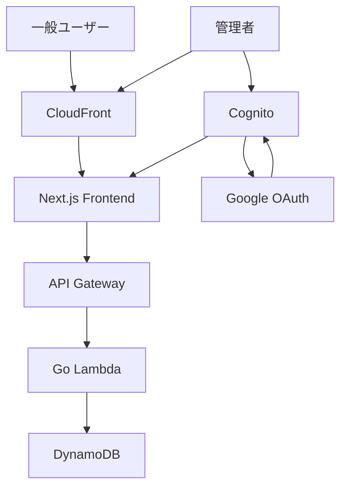
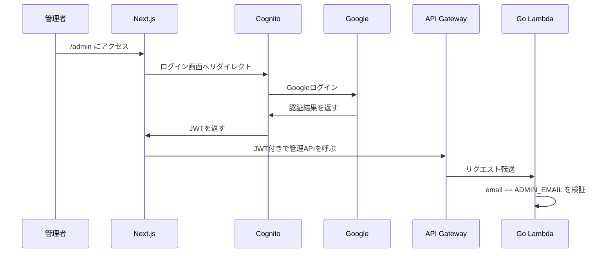
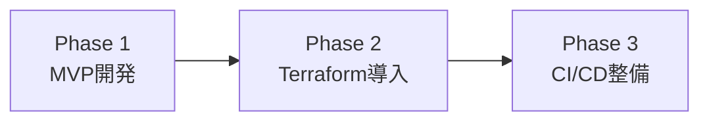

# 個人ポートフォリオサイト 要件定義書

## 概要

AWS上に個人ポートフォリオサイトを構築する。

一般ユーザーは作品・記事・プロフィールを閲覧できる。  
管理者のみがCognito経由でGoogleログインし、管理画面からコンテンツを更新できる。

## システム構成



## 技術スタック

- Frontend: Next.js / TypeScript
- Backend: Go
- Runtime: AWS Lambda
- API: API Gateway
- Database: DynamoDB
- Auth: Amazon Cognito + Google OAuth
- Hosting/CDN: CloudFront
- Infrastructure: Terraform（Phase 2で導入）

## 利用者

## 一般ユーザー

できること。

- 作品閲覧
- 記事閲覧
- プロフィール閲覧

できないこと。

- 管理画面アクセス
- データ更新

## 管理者

できること。

- Googleログイン
- 作品作成
- 作品編集
- 作品削除
- 記事作成
- 記事編集
- 記事削除
- プロフィール編集

## ページ一覧

## 公開ページ

- `/`
- `/works`
- `/works/[id]`
- `/articles`
- `/articles/[id]`
- `/profile`

## 管理ページ

- `/admin`
- `/admin/works`
- `/admin/works/new`
- `/admin/works/[id]/edit`
- `/admin/articles`
- `/admin/articles/new`
- `/admin/articles/[id]/edit`
- `/admin/profile`

## 認証・認可

認証には Amazon Cognito を使用する。  
Cognito の外部IdPとして Google OAuth を設定する。

認証フローは以下。



管理者判定はバックエンド側でも必ず行う。

```go
if user.Email != os.Getenv("ADMIN_EMAIL") {
    return 403
}
```

## API一覧

## Public API

認証不要。

- `GET /works`
- `GET /works/{id}`
- `GET /articles`
- `GET /articles/{id}`
- `GET /profile`

## Admin API

認証必須。

- `POST /admin/works`
- `PUT /admin/works/{id}`
- `DELETE /admin/works/{id}`
- `POST /admin/articles`
- `PUT /admin/articles/{id}`
- `DELETE /admin/articles/{id}`
- `PUT /admin/profile`

## データモデル

```ts
type Work = {
  id: string;
  title: string;
  description: string;
  body: string;
  thumbnailUrl?: string;
  githubUrl?: string;
  projectUrl?: string;
  technologies: string[];
  published: boolean;
  createdAt: string;
  updatedAt: string;
};

type Article = {
  id: string;
  title: string;
  excerpt: string;
  body: string;
  tags: string[];
  published: boolean;
  createdAt: string;
  updatedAt: string;
};

type Profile = {
  id: "main";
  name: string;
  bio: string;
  skills: string[];
  github?: string;
  x?: string;
  linkedin?: string;
  website?: string;
  updatedAt: string;
};
```

## DynamoDB設計

テーブル名。

```txt
portfolio
```

キー構成。

```txt
PK
SK
```

データ例。

```txt
PK=WORK
SK=WORK#<id>

PK=ARTICLE
SK=ARTICLE#<id>

PK=PROFILE
SK=PROFILE#main
```

公開ページでは `published=true` のデータのみ表示する。

## 開発フェーズ



## Phase 1: MVP開発

まず動くプロダクトを完成させる。

- Next.js作成
- Go Lambda作成
- DynamoDB連携
- Cognito + Googleログイン設定
- 管理画面作成
- AWSへデプロイ

## Phase 2: Terraform導入

初期構築後にIaC化する。

- 既存AWSリソースをTerraform import
- Terraformで管理
- READMEに構成を記載

## Phase 3: CI/CD整備

- GitHub Actions導入
- フロントエンド自動デプロイ
- Lambda自動デプロイ

## 技術選定理由

## Lambda

個人ポートフォリオは常時稼働サーバーを必要としないため、EC2/ECSではなくLambdaを採用する。  
アクセスが少ない期間のコストを抑えられる。

## DynamoDB

閲覧主体であり、複雑なJOINやトランザクション要件が少ないため、RDSではなくDynamoDBを採用する。  
Lambdaとの相性が良く、低コストで運用しやすい。

## Go

バックエンド開発の学習目的で採用する。  
型安全性、実行性能、シンプルな言語仕様を評価する。

## Cognito

AWS上で認証基盤を構築する学習目的で採用する。  
GoogleログインをCognito経由にすることで、AWSサービスとして認証・認可を管理できる。

## Terraform

初期段階では手動構築を許容する。  
MVP完成後にTerraform importを使い、既存リソースをIaC化する。

## 成果物

- Next.jsフロントエンド
- Go Lambda API
- DynamoDB
- Cognito + Googleログイン
- 管理画面
- README
- Terraformコード（Phase 2）